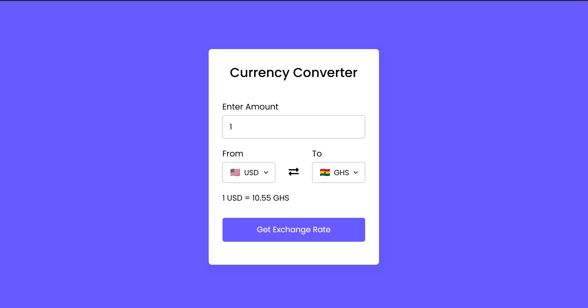

# 💸 Currency Converter

A simple yet elegant currency converter web application built with **HTML**, **CSS**, and **JavaScript**. This tool allows users to convert between various global currencies in real-time using the [ExchangeRate API](https://www.exchangerate-api.com). 

---

## 🚀 Features

- 🔁 Real-time currency conversion  
- 🌍 Supports over 150+ world currencies  
- 🎨 Responsive and modern UI  
- ⚡ Lightweight and fast  
- 📱 Mobile-friendly design  

---

## 🧪 How It Works

The app fetches live exchange rate data from the ExchangeRate API and dynamically updates the converted amount as the user selects different currencies or inputs new values.

All logic is implemented in vanilla JavaScript, making it fast and easy to understand for beginners and perfect for learning purposes.

---

## 📁 Project Structure

currency-converter/
│
├── index.html # HTML structure
├── style.css # Styling and responsive design
├── script.js # Core functionality and API integration
├── screenshot.png # Preview of the app
└── README.md # Project documentation

---

## 🛠️ Technologies Used

- **HTML5** – For semantic structure and form elements  
- **CSS3** – For styling and responsiveness  
- **JavaScript (Vanilla)** – For dynamic behavior and API calls  
- **ExchangeRate API** – For real-time currency conversion rates  

---

## 🧑‍💻 Builder

This project was developed by **[Your Name]**, a [student/developer/web enthusiast] passionate about building clean, functional, and user-friendly web applications. With a focus on simplicity and performance, this project serves as both a practical utility and a hands-on learning experience in front-end development.

Feel free to reach out:
- 📧 Email: [antwijescaps1@gmail.com]  
- 💼 LinkedIn: [linkedin.com/in/jescapsantwi/](https://linkedin.com/in/yourprofile)   
- 🐱 GitHub: [github.com/yourusername](https://github.com/jescapsantwi) 

---

---

## 🌐 Live Demo

[View the deployed version here](https://netlify-url.netlify.app) 

---

## 📷 Screenshot

---

## 📝 License

This project is open source and available under the **MIT License**.
